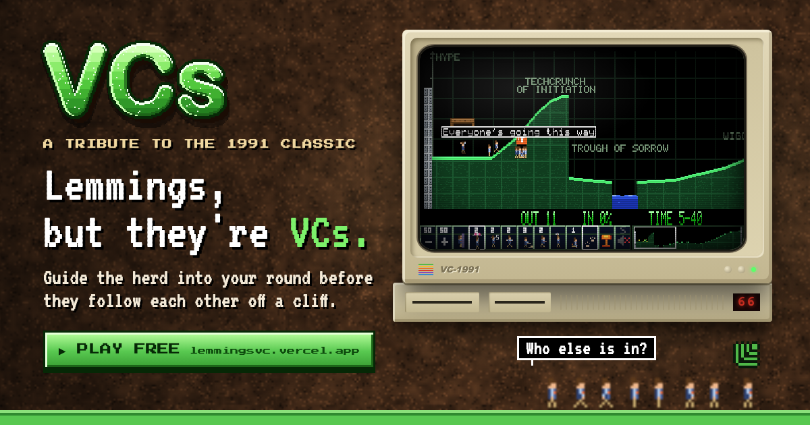
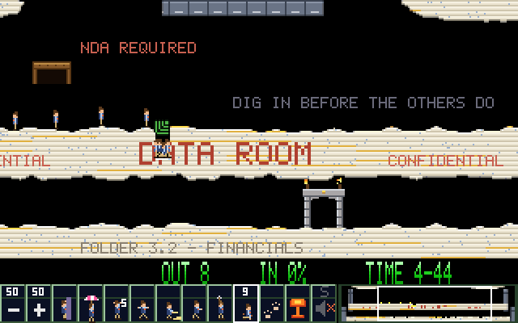
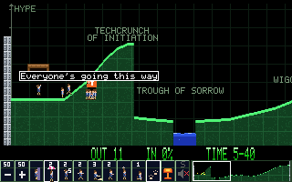
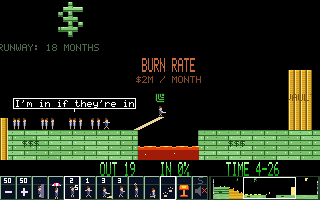
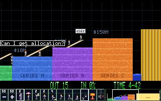

# VCs: Lemmings, but they're VCs

**▶ Play it free: https://lemmingsvc.vercel.app**

Guide the herd into your round before they follow each other off a cliff. A browser tribute to the 1991 classic *Lemmings*, where every lemming is a venture capitalist in a fleece vest, and the lead investor (Sequoia, a16z or YC) always goes first.





## The game

- **Real Lemmings mechanics:** all 8 skills (climber, floater, bomber, blocker, builder, basher, miner, digger), fall damage, release rate, nuke, minimap.
- **9 startup-themed levels:** Dig into the data room · Only SAFEs survive this · Bridge round · Due diligence · Everyone else is in · The startup curve · Burn rate · Series A, B, C · Demo Day.
- **Herd behavior:** VCs mutter things like *"Who else is in?"*, *"Can I get allocation?"* and *"We were early believers."*
- **No build step:** one HTML file plus a sounds file, playable on desktop and mobile (drag to scroll, tap to assign).

| | | |
|---|---|---|
|  |  |  |

## Controls

| Input | Action |
|---|---|
| Click a skill, then click a VC | Assign the skill (keys `1`–`8` or `F3`–`F10` pick skills) |
| `F1` / `F2` | Release rate down / up |
| `P` | Pause (you can still assign skills) |
| `F` | Fast forward |
| Double-click the mushroom cloud, or `F12` | Nuke |
| `S` / `M` | Sound / music on-off (both start off) |
| Arrow keys, or push the mouse to an edge | Scroll |
| Touch | Drag to scroll, tap a VC to assign |

## Run it locally

```bash
python3 -m http.server 8742
```

Open http://localhost:8742 for the landing page or http://localhost:8742/play/ for the game.

- `/play/?level=6` jumps straight to a level.
- `/play/?attract` makes the game play itself (used on the landing page).

## Tests

Every level has an automated "doing nothing loses" and "the scripted solution wins" check. On `/play/`, in the browser console:

```js
await import('./tests.js').then(m => m.run())
```

## Repo layout

| Path | What it is |
|---|---|
| `index.html`, `img/` | Landing page |
| `play/` | The game (`index.html`), voice clips (`sounds.js`), level tests (`tests.js`) |
| `video/` | The promo trailer, a [HyperFrames](https://github.com/heygen-com/hyperframes) project built from captured gameplay (`cd video && npx hyperframes render`) |
| `tools/` | Link-preview card source (`og-card.html`, rendered by `make-og.sh`) |
| `deploy.sh` | Deploys the site to Vercel |

## Credits

- Game mechanics adapted from [Lemmings.ts](https://github.com/tomsoftware/Lemmings.ts) by Thomas Zeugner (MIT).
- All art, levels and music are original. Voice lines were generated with ElevenLabs.
- Fonts in the trailer: Press Start 2P and VT323 (SIL Open Font License).

A tribute to *Lemmings* (DMA Design, 1991). Not affiliated with the original game, its publishers, or any of the funds whose names and marks appear here, which are used for parody. See [LICENSE](LICENSE).

Made by [@thatguybg](https://x.com/thatguybg).
